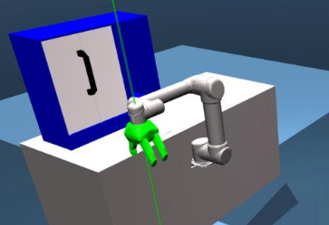

# UR5 Door Opening with Tactile and Force/Torque Simulation

Reinforcement-learning environment for opening a door with a UR5 robot and a
Robotiq three-finger gripper in MuJoCo. The project uses TD3 and supports tactile
observations, wrist force/torque sensing, domain randomization, checkpoint
evaluation, and robustness tests for table-position offsets.

This repository is a UR5-focused extension of
[Robotic Door Opening with Tactile Simulation](https://github.com/quantumiracle/Robotic_Door_Opening_with_Tactile_Simulation)
by Zihan Ding, Ya-Yen Tsai, Wang Wei Lee, and Bidan Huang. The original Franka
Panda environment remains available for compatibility.

<p align="center">
  
</p>

<p align="center"><em>UR5 door-opening environment with a Robotiq three-finger gripper in MuJoCo.</em></p>

## Features

- UR5 robot model with six controlled arm joints
- Robotiq three-finger gripper with movable or fixed finger flexion
- MuJoCo door-opening task and shaped reward
- TD3 training with parallel exploration workers
- Optional raw or normalized six-axis wrist F/T observations
- Optional simulated tactile observations
- Domain randomization of table position
- CSV logging and plots for force/torque evaluation
- Policy robustness sweeps over table x/y offsets
- Compatibility mode for legacy UR5 and Panda checkpoints

## Requirements

The provided environment targets Linux with:

- Python 3.8
- MuJoCo 2.1
- `mujoco-py==2.1.2.14`
- PyTorch, Gym, NumPy, Matplotlib, and TensorBoard

MuJoCo and its system libraries must be installed before `mujoco-py` can be
used. The Conda file contains the Python environment, but it does not install
the MuJoCo binary itself.

## Installation

Clone the repository and create the supplied Conda environment:

```bash
git clone https://github.com/AntonioBerecic/Robotic_Door_Opening_UR5.git
cd Robotic_Door_Opening_UR5

conda env create -f ur5door.yaml
conda activate ur5door
pip install -e ./environment/robolite
```

The editable `robolite` installation is required so that the included UR5
environment and model changes are used directly from this repository.

For an existing compatible environment, the smaller dependency list can be
installed instead:

```bash
pip install -r requirements.txt
pip install -e ./environment/robolite
```

## Quick environment check

Initialize the UR5 environment, sample one action, and validate observation and
action dimensions without starting training:

```bash
python train.py --env ur5opendoorfktactile
```

To inspect the robot, gripper joints, actuators, and several poses in the MuJoCo
viewer:

```bash
python view_env.py
```

## Training

Train the default UR5 policy with TD3:

```bash
python train.py --train --env ur5opendoorfktactile --process 2
```

Use the shorter preset for iteration and debugging:

```bash
python train.py --train --env ur5opendoorfktactile --process 2 --fast
```

The main training values are defined in `default_params.py`. They can also be
overridden from the command line, for example:

```bash
python train.py --train --env ur5opendoorfktactile \
  --max_episodes 3000 --max_steps 500 --update_itr 10 \
  --explore_steps 2000 --eval_interval 250
```

Checkpoints are written to `data/weights/`, while reward histories are written
to `log/`. These generated directories are intentionally excluded from Git.

## Force/torque observation modes

The UR5 environment supports three F/T modes:

| Option | Observation | Intended use |
| --- | --- | --- |
| `--no_ft` | F/T values excluded | Default training mode |
| `--use_ft` | Six raw F/T values | New experiments using wrist sensing |
| `--normalized_ft` | Six legacy-scaled values | Compatibility with older checkpoints |

Pass the same observation mode during training and evaluation. A mismatch
changes the policy input size and prevents a checkpoint from loading correctly.

Example with raw F/T observations:

```bash
python train.py --train --env ur5opendoorfktactile --use_ft --process 2
```

By default, the seventh policy action controls gripper flexion. To run a
six-action policy with fixed fingers, specify a flexion value:

```bash
python train.py --train --env ur5opendoorfktactile \
  --fixed_gripper_flexion 0.1 --process 2
```

## Checkpoint evaluation

Evaluate a saved checkpoint with rendering:

```bash
python train.py --test --env ur5opendoorfktactile \
  --model MODEL_DIRECTORY --model_id CHECKPOINT_ID --render --no_ft
```

`MODEL_DIRECTORY` is normally a directory inside `data/weights/`, and
`CHECKPOINT_ID` is the numeric checkpoint prefix created during training.

For an older checkpoint, the compatibility options are available when needed:

```bash
python train.py --test --env ur5opendoorfktactile \
  --model MODEL_DIRECTORY --model_id CHECKPOINT_ID --render \
  --normalized_ft --legacy_reward
```

## Force/torque logging

Print wrist measurements during evaluation and save every sample to CSV:

```bash
python train.py --test --env ur5opendoorfktactile \
  --model MODEL_DIRECTORY --model_id CHECKPOINT_ID --render \
  --use_ft --debug_ft --debug_ft_every 10 \
  --ft_log log/ft_evaluation.csv
```

Create a plot from the resulting log:

```bash
python plot_ft_results.py log/ft_evaluation.csv \
  --output log/ft_evaluation_plot.png
```

Add `--show` to display the plot interactively.

## Table-offset robustness evaluation

Evaluate a trained UR5 policy over a grid of table-position offsets:

```bash
python test_ur5_table_offsets.py \
  --model MODEL_DIRECTORY --model_id CHECKPOINT_ID \
  --limit_cm 5 --step_cm 1 --no_render
```

The evaluator records success, episode reward, end-effector distance,
orientation error, and door angle. Plot one or more result files with:

```bash
python plot_ur5_table_offsets.py RESULTS.csv --show
```

Use `--sweep axes` instead of the default grid to vary one axis at a time.

## Panda compatibility

The original Panda task is still registered and can be run with:

```bash
python train.py --train --env pandaopendoorfktactile --process 2
```

## Project structure

```text
environment/ur5opendoorfktactile.py              Gym-style UR5 wrapper
environment/robolite/robosuite/environments/     UR5 and door task logic
environment/robolite/robosuite/models/            Robot and gripper models
rl/td3/                                            TD3 implementation
default_params.py                                  Training hyperparameters
train.py                                           Training and evaluation entry point
test_ur5_table_offsets.py                          Robustness evaluator
plot_ft_results.py                                 Wrist F/T plots
plot_ur5_table_offsets.py                          Offset-evaluation plots
ur5door.yaml                                       Reproducible Conda environment
```

## Acknowledgements

This repository extends the simulation code from
[Robotic Door Opening with Tactile Simulation](https://github.com/quantumiracle/Robotic_Door_Opening_with_Tactile_Simulation),
developed by Zihan Ding, Ya-Yen Tsai, Wang Wei Lee, and Bidan Huang for
“Sim-to-Real Transfer for Robotic Manipulation with Tactile Sensory,” IROS 2021.

### Citation

The original work can be cited as:

```bibtex
@article{ding2021sim,
  title={Sim-to-Real Transfer for Robotic Manipulation with Tactile Sensory},
  author={Ding, Zihan and Tsai, Ya-Yen and Lee, Wang Wei and Huang, Bidan},
  journal={arXiv preprint arXiv:2103.00410},
  year={2021}
}
```
